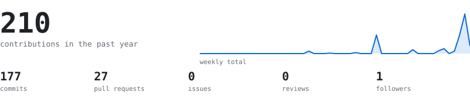
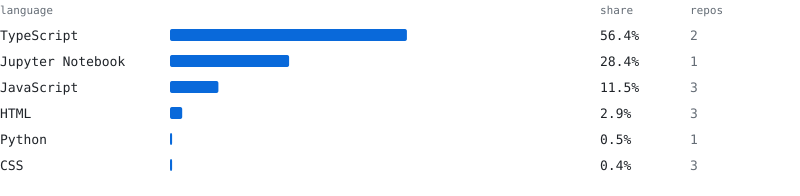
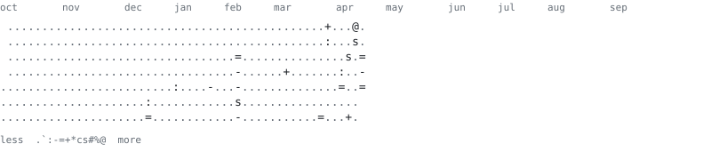

> Full-stack developer and BCA student in Ranchi, India. 
> Building across the JavaScript and Node.js ecosystem.

<samp>JavaScript · Node.js</samp>

<!--PROJECTS:START-->
<samp>6 public repositories · all listed</samp>

- **[xreep](https://github.com/xreep/xreep)** <samp>Python · ★ 0 · pushed 2026-10</samp>
- **[raksha](https://github.com/xreep/raksha)** — Offline AI health guardian for heat waves, floods and smog. On-device risk scoring and emergency SOS. <samp>TypeScript · ★ 1 · pushed 2026-10</samp>
- **[Seasonal-Agriculture-Performance-Analysis](https://github.com/xreep/Seasonal-Agriculture-Performance-Analysis)** <samp>Jupyter Notebook · ★ 1 · pushed 2026-09</samp>
- **[parkease](https://github.com/xreep/parkease)** <samp>JavaScript · ★ 0 · pushed 2026-07</samp>
- **[disasterlink](https://github.com/xreep/disasterlink)** — Real-time disaster resource coordination platform <samp>TypeScript · ★ 0 · pushed 2026-04</samp>
- **[Sanjeevni](https://github.com/xreep/Sanjeevni)** <samp>HTML · ★ 0 · pushed 2026-04</samp>
<!--PROJECTS:END-->
